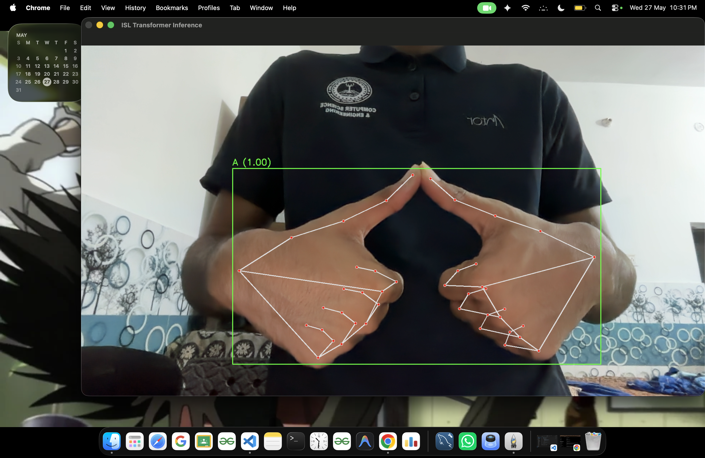
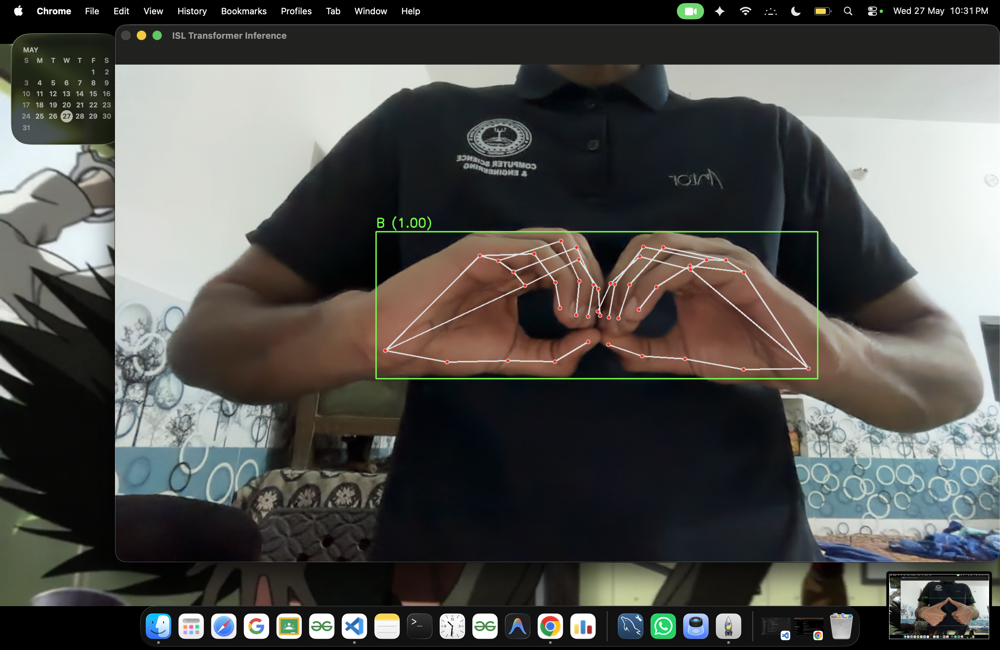
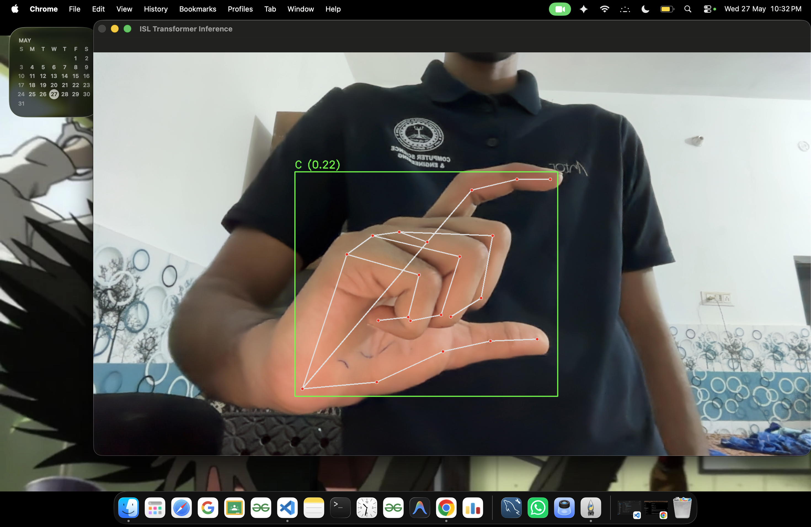
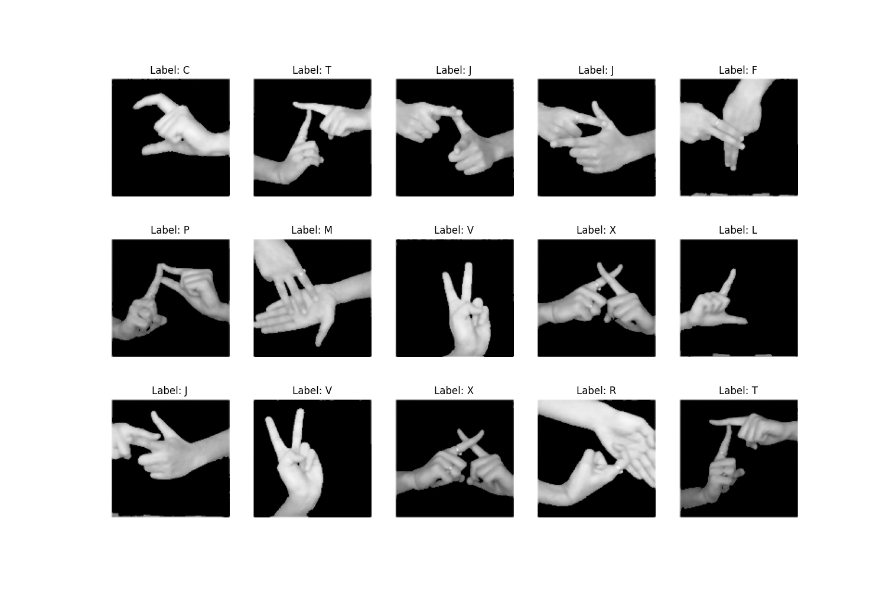

# 🤟 Indian Sign Language Recognition System

A real-time Indian Sign Language (ISL) recognition system built using a **Landmark-Based Transformer Architecture**.  
Unlike traditional CNN-based approaches that rely on raw image pixels, this project focuses on the geometric relationships between hand landmarks, making the system faster, more stable, and highly robust to environmental variations.

---

# ✨ Features

- 🚀 Real-time ISL alphabet recognition using webcam input
- 🧠 Transformer Encoder architecture for spatial relationship learning
- ✋ Supports both single-hand and two-hand sign detection
- 🌍 Robust against lighting conditions, background noise, and skin tone variations
- ⚡ Lightweight and optimized for real-time CPU inference
- 📊 Landmark-based processing using MediaPipe hand tracking
- 🔒 Stable predictions using confidence filtering and majority voting

---

# 🏗️ Project Structure

```text
isl_project/
│
├── dataset/
│   ├── raw/merged/
│   └── landmarks.npz
│
├── models/
│
├── src/
│   ├── preprocessing/
│   │   └── extract_landmarks.py
│   │
│   ├── training/
│   │   └── transformer_model.py
│   │
│   └── inference/
│       └── transformer_inference.py
│
├── train_transformer.py
├── requirements.txt
└── README.md
```

---

# 🛠️ Tech Stack

- Python
- TensorFlow / Keras
- MediaPipe
- OpenCV
- NumPy

---

# 🚀 Getting Started

## 1. Clone the Repository

```bash
git clone https://github.com/<your-username>/Indian-Sign-Language-Recognition.git
cd Indian-Sign-Language-Recognition
```

---

## 2. Create Virtual Environment

### Using Conda

```bash
conda create -n isl_311 python=3.11
conda activate isl_311
```

### Install Dependencies

```bash
pip install -r requirements.txt
```

---

# 📂 Dataset Preparation

Don't Forget to download the ISL Dataset from Kaggle

The Link is here : [ISL Dataset](https://www.kaggle.com/datasets/rushilverma07/indian-sign-language-alphabet-dataset)

Extract geometric hand landmarks from the dataset images:

```bash
python src/preprocessing/extract_landmarks.py
```

This converts raw images into normalized landmark representations for training.

---

# 🧠 Model Training

Train the Transformer-based ISL classifier:

```bash
python train_transformer.py
```

The trained model weights will be saved inside the `models/` directory.

---

# 🎥 Real-Time Inference

Run the live webcam-based ISL recognition system:

```bash
python src/inference/transformer_inference.py
```

---

# Live Testing of Model
**Alphabet A**



**Alphabet B**



**Alphabet C**



**Dataset Verification**



# 🧬 Model Architecture

## 🔹 Landmark Extraction

The system uses the MediaPipe Hand Landmark Detection pipeline to extract:

- 21 hand landmarks per hand
- Each landmark contains:
  - X coordinate
  - Y coordinate
  - Z depth value

### Normalization
- Wrist-centered normalization
- Scale normalization for consistent geometry

This improves robustness against:
- Camera distance
- Hand position
- Lighting variations

---

## 🔹 Transformer Encoder

The Transformer treats hand landmarks as a sequence of geometric tokens.

### Key Components

- Multi-Head Self Attention
- Feed Forward Layers
- Positional Understanding of Hand Geometry
- Variable-Length Sequence Handling

The same model can process:
- Single-hand inputs (21 landmarks)
- Two-hand inputs (42 landmarks)

---

# 📊 Performance Comparison

| Feature | CNN-Based Approach | Transformer-Based Approach |
|---|---|---|
| Input Type | Raw Pixels | Geometric Landmarks |
| Input Size | 128×128×3 | 21×3 or 42×3 |
| Background Sensitivity | High | Very Low |
| Lighting Sensitivity | High | Very Low |
| Inference Speed | Moderate | Fast |
| Real-Time Stability | Medium | High |

---

# 🎮 Controls

| Key | Action |
|---|---|
| ESC | Exit application |
| S | Future feature: Save detected text |

---

# 🌟 Future Improvements

- Sentence-level sign recognition
- Temporal Transformers for dynamic gestures
- Text-to-speech integration
- Web deployment using Flask/Streamlit
- Mobile application support

---

# 👥 Team

Developed during the **HackJKLU Hackathon** as part of a project focused on improving accessibility through AI-powered sign language recognition.

---

# 📜 License

This project is intended for educational and research purposes.

---

# 🤟 Acknowledgement

Special thanks to:
- MediaPipe
- TensorFlow
- OpenCV
- The open-source community

---
